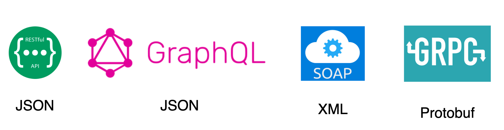

# Communication Styles

- [x] Unary
- [ ] Client Streaming
- [ ] Server Streaming
- [ ] Bi-directional

## Unary

```bash
git checkout feature/gRPC-unary
```

## Client Streaming

```bash
git checkout feature/gRPC-client-stream
```

## Server Streaming

```bash
git checkout feature/gRPC-server-stream
```

## Bi-directional

```bash
git checkout feature/gRPC-bi-directional
```

## Message formats comparison



<br>
Protobuf

- Binary format
  - Not human-readable
- Efficient and fast
- Compatible with most modern development platforms
- Generates client classes
- Cross-language compatibility

<br>
Protobuf Usage Flow

1. Define messages and services
2. Generate code
3. Use the generated code
